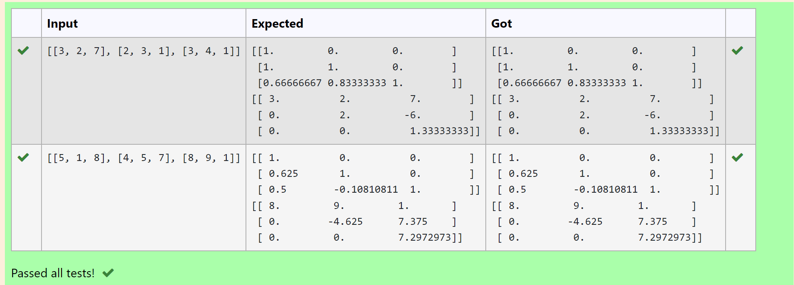

# LU Decomposition without zero on the diagonal

## AIM:
To write a program to find the LU Decomposition of a matrix.

## Equipments Required:
1. Hardware – PCs
2. Anaconda – Python 3.7 Installation / Moodle-Code Runner

## Algorithm
1. import numpy library using import statement.
2. From scipy package import lu().
3. Get input from user and pass it as an array.
4. Get P, L U martix using lu().
5. print L and U matrix.

## Program:
```
/*
Program to find the LU Decomposition of a matrix.
Developed by: Swathika G
RegisterNumber: 21500231
# To print L and U matrix
import numpy as np
from scipy.linalg import lu
#import scipy
A = np.array(eval(input()))
P, L, U = lu(A)
#P, L, U = scipy.linalg.lu(A)
print(L)
print(U)

*/
```
```
Program to find the LU Decomposition of a matrix.
Developed by: Swathika G
RegisterNumber: 21500231
# To print X matrix (solution to the equations)
import numpy as np
from scipy.linalg import lu_factor, lu_solve
A=np.array(eval(input()))
B=np.array(eval(input()))
lu,pivot= lu_factor(A)
x=lu_solve((lu,pivot),B)
print(x)

## Output:
```



## Result:
Thus the program to find the LU Decomposition of a matrix is written and verified using python programming.

